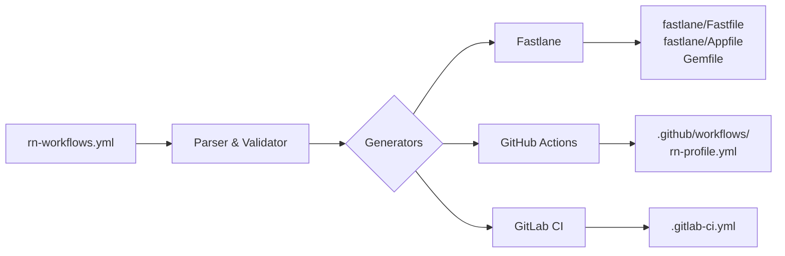

# rn-workflows

Open-source CLI alternative to EAS Workflows. Define build profiles in one YAML file, generate Fastlane lanes + GitHub Actions + GitLab CI pipelines automatically.

## Why

EAS Workflows (Expo) is paid SaaS, tied to Expo, not self-hostable. `rn-workflows` is the open equivalent: works with bare React Native and Expo, supports multiple CI providers, emits plain Fastlane so you can debug and extend locally.

## How it works



## Install

```bash
npx rn-workflows init
npx rn-workflows generate
```

Or add as dev dependency:

```bash
npm install --save-dev rn-workflows
# or
bun add -d rn-workflows
```

## Commands

| Command | Description |
| --- | --- |
| `rn-workflows init` | Interactively create `rn-workflows.yml`. Use `--force` to overwrite. |
| `rn-workflows generate` | Generate Fastlane + CI files from config. Flags: `--ci <provider>`, `--dry-run`, `--config <path>`, `--cwd <dir>`. |

## Config shape

```yaml
project:
  type: expo         # or bare
  bundleId: com.myapp
  packageName: com.myapp

ci: github-actions   # or gitlab

build:
  preview:
    platform: android
    distribution: firebase
    android:
      buildType: apk
  staging:
    platform: all
    distribution: testflight+firebase
    ios:
      exportMethod: ad-hoc
  production:
    platform: all
    distribution: store
    android:
      buildType: aab
    ios:
      exportMethod: app-store
```

## Supported distributions

| Key | Target |
| --- | --- |
| `firebase` | Firebase App Distribution |
| `testflight` | Apple TestFlight |
| `appcenter` | Microsoft App Center |
| `github-releases` | GitHub Releases artifact upload |
| `store` | Google Play + App Store |

Combine multiple targets with `+`, e.g. `testflight+firebase`.

## Required CI secrets

| Distribution | Android env vars | iOS env vars |
| --- | --- | --- |
| `firebase` | `FIREBASE_APP_ID_ANDROID`, `FIREBASE_SERVICE_ACCOUNT_JSON` | `FIREBASE_APP_ID_IOS`, `FIREBASE_SERVICE_ACCOUNT_JSON` |
| `testflight` | — | `APP_STORE_CONNECT_API_KEY_PATH`, `APPLE_TEAM_ID` |
| `appcenter` | `APPCENTER_API_TOKEN`, `APPCENTER_OWNER_NAME`, `APPCENTER_APP_NAME_ANDROID` | `APPCENTER_API_TOKEN`, `APPCENTER_OWNER_NAME`, `APPCENTER_APP_NAME_IOS` |
| `store` | `PLAY_STORE_JSON_KEY` | `APP_STORE_CONNECT_API_KEY_PATH`, `APPLE_TEAM_ID` |

iOS jobs also require `MATCH_PASSWORD` and `MATCH_GIT_URL` for code signing via [fastlane match](https://docs.fastlane.tools/actions/match/).

## Generated files

Given `ci: github-actions`:
- `fastlane/Fastfile`, `fastlane/Appfile`, `fastlane/Pluginfile`, `Gemfile`
- `.github/workflows/rn-<profile>.yml` for each profile

Given `ci: gitlab`:
- `fastlane/Fastfile`, `fastlane/Appfile`, `fastlane/Pluginfile`, `Gemfile`
- `.gitlab-ci.yml` with one stage per profile × platform

## Requirements

- Node.js `>=20`

## Contributing

```bash
bun install
bun test        # run all tests
bun run build   # compile to dist/
```

Tests live in `tests/`. Snapshots in `tests/__snapshots__/` are committed — update with `bun test --update-snapshots` after intentional template changes.

## Roadmap

- `build --profile` local exec
- App Center / GitHub Releases distribution
- OTA deploy step (integration with [xavia-ota](https://github.com/xaviadao/xavia-ota))
- Diff mode to show what would change in existing CI files

## License

MIT
