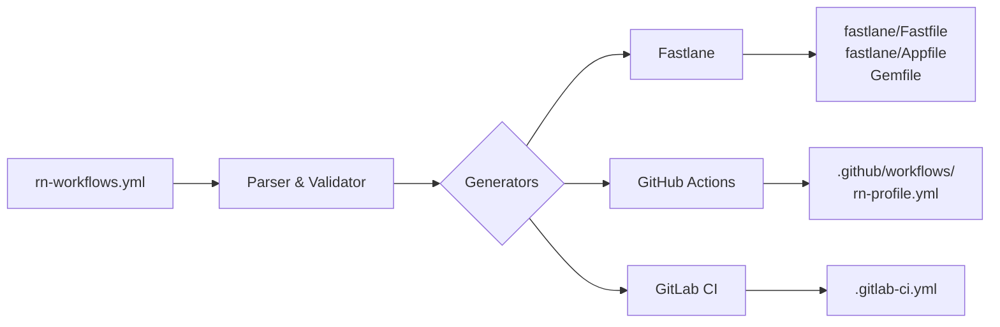
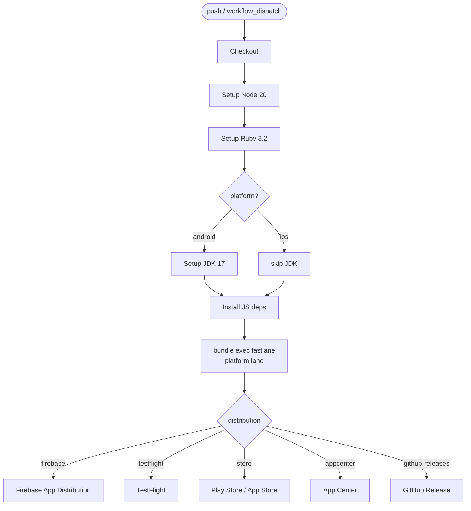

# Mermaid Diagrams in README

## Summary

Add two static Mermaid diagrams to `README.md` to visualize (1) tool architecture and (2) generated CI workflow steps.

## Approach

Static Mermaid blocks embedded directly in README. Renders natively on GitHub. No code changes required — diagrams are stable and don't need auto-generation.

## Placement

- New `## How it works` section inserted between "Why" and "Install" — contains tool architecture diagram.
- New `## Generated workflow` section inserted after "Generated files" — contains CI workflow diagram.

## Diagram 1 — Tool architecture (`flowchart LR`)

Shows data flow from config input through parsers and generators to output files.

## Diagram 2 — Generated CI workflow (`flowchart TD`)

Shows the step sequence inside a generated GitHub Actions job, including platform branching and distribution targets.

## Implementation

Single task: insert two sections with Mermaid blocks into `README.md`. No new files, no code changes.
